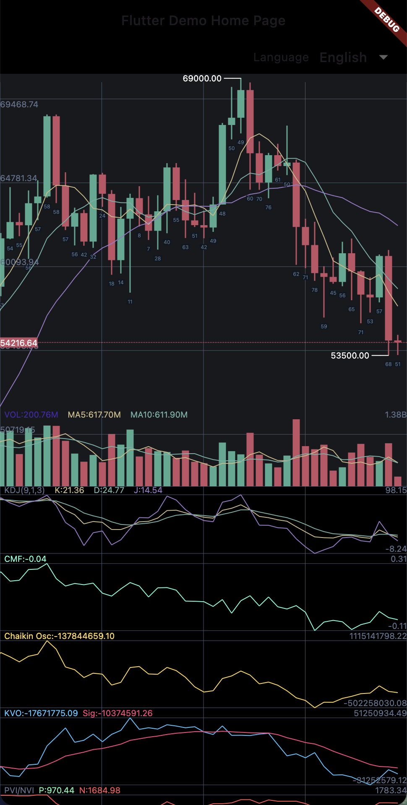
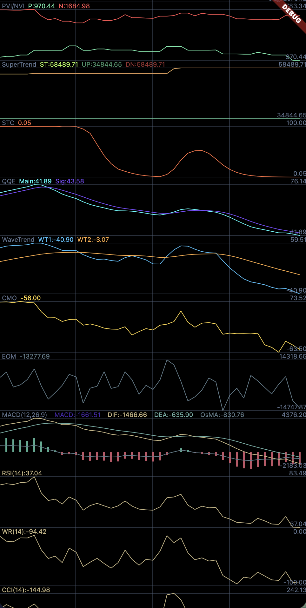
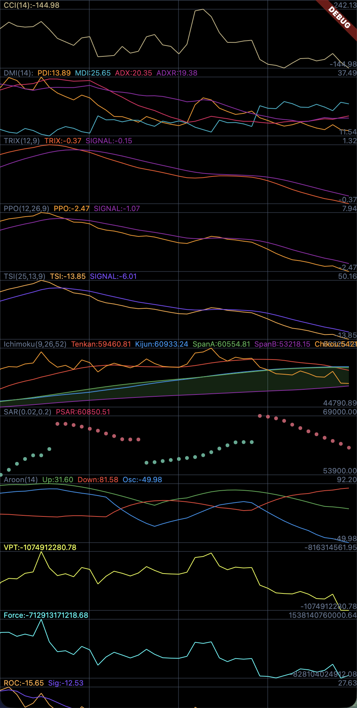
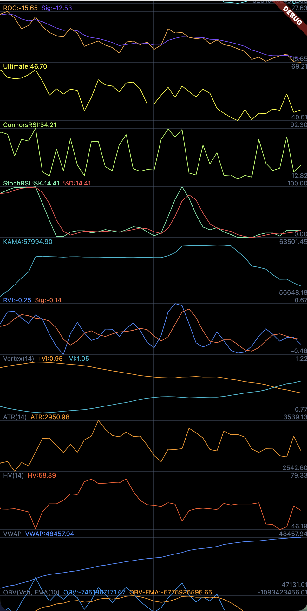
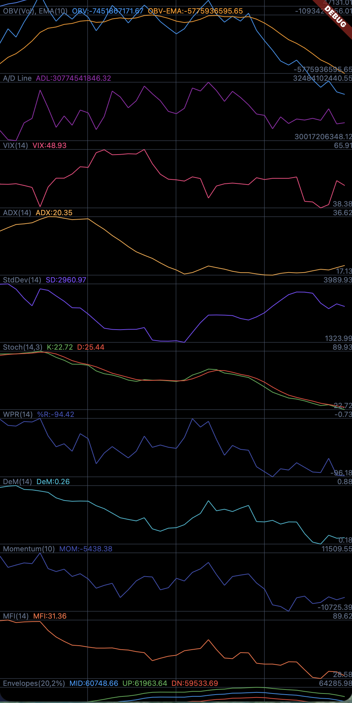
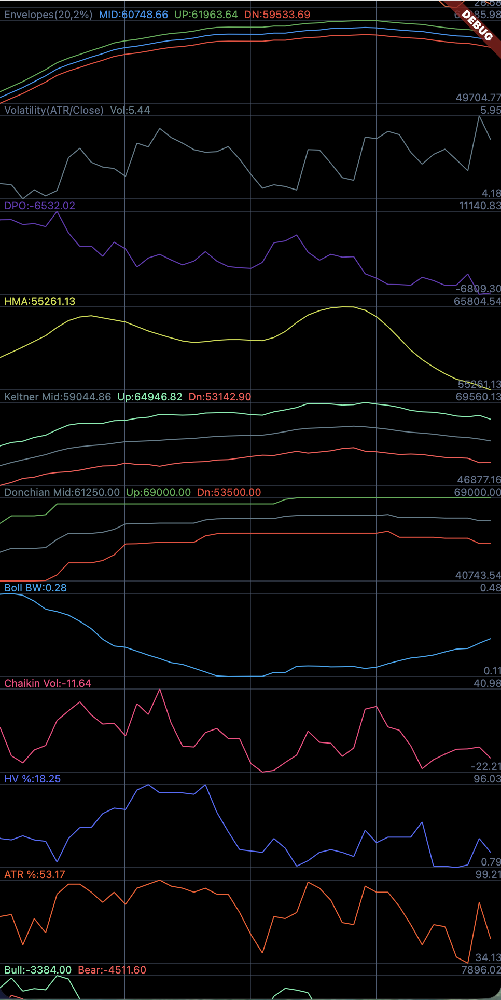
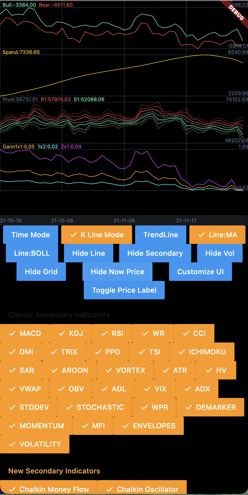
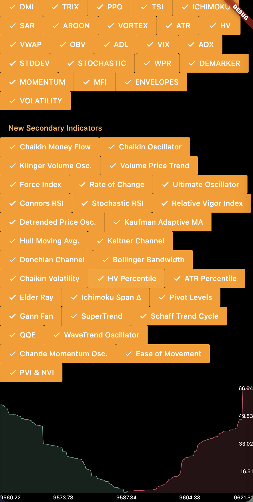

# k_chart_multiple

A production-ready Flutter candlestick charting library. Render multiple market charts on the same screen, combine dozens of indicators, and wire the output into trading overlays, callbacks, and custom UI.

## Preview










## Feature Highlights
- Manage multiple `KChartWidget` instances with custom sizing and scroll behavior.
- Built-in main chart overlays (MA, BOLL) and 50+ secondary indicators via `List<SecondaryState>`.
- Candlesticks, timeline view, trend-line drawing, market depth, and volume bars out of the box.
- Fine-grained appearance control with `ChartStyle`, `ChartColors`, localization, and time formatting.
- Probability engine, trading markers (`TradeMark`), and callbacks for strategy integration.
- Ships with a fully working example and local data so you can run it immediately.

## Getting Started
1. **Add the dependency**
   ```yaml
   dependencies:
     k_chart_multiple: ^1.1.0
   ```

2. **Import the package**
   ```dart
   import 'package:k_chart_multiple/flutter_k_chart.dart';
   ```

3. **Prepare data**
   ```dart
   final raw = await rootBundle.loadString('assets/chatData.json');
   final List<dynamic> list = json.decode(raw)['data'];
   final datas = list
       .map((e) => KLineEntity.fromJson(e as Map<String, dynamic>))
       .toList()
       .reversed
       .toList();
   DataUtil.calculate(datas); // required: computes MA, indicators, probabilities, etc.
   ```

4. **Render a single chart**
   ```dart
   final chart = KChartWidget(
     datas,
     ChartStyle(),
     ChartColors(),
     isTrendLine: false,
     mainState: MainState.MA,
     secondaryStates: const [SecondaryState.MACD, SecondaryState.RSI],
     volHidden: false,
     showNowPrice: true,
     timeFormat: TimeFormat.YEAR_MONTH_DAY_WITH_HOUR,
     translations: kChartTranslations,
     onLoadMore: (isRightEdge) {
       if (isRightEdge) fetchMore();
     },
   );
   ```

## Multiple Charts on One Screen
`KChartWidget` behaves like any other Flutter widget. Place it inside a `ListView`, `GridView`, or `TabBarView`. The sample below renders several indicator combinations in a grid:

```dart
class MultipleCharts extends StatelessWidget {
  final List<List<SecondaryState>> secondaryCombos;
  final List<KLineEntity> source;

  const MultipleCharts({
    super.key,
    required this.secondaryCombos,
    required this.source,
  });

  @override
  Widget build(BuildContext context) {
    return GridView.builder(
      padding: const EdgeInsets.all(12),
      gridDelegate: const SliverGridDelegateWithFixedCrossAxisCount(
        crossAxisCount: 2,
        mainAxisSpacing: 12,
        crossAxisSpacing: 12,
        childAspectRatio: 0.75,
      ),
      itemCount: secondaryCombos.length,
      itemBuilder: (_, index) {
        return Card(
          color: Colors.black,
          child: KChartWidget(
            source,
            ChartStyle()
              ..childPadding = 8,
            ChartColors(),
            isTrendLine: false,
            mainState: MainState.MA,
            secondaryStates: secondaryCombos[index],
            volHidden: index.isEven,
            showNowPrice: true,
            fixedLength: 2,
            timeFormat: TimeFormat.YEAR_MONTH_DAY,
            mainHeight: 260,
            secondaryHeight: 90,
            onSecondaryTap: (i) {
              debugPrint('Tapped secondary chart $i of card $index');
            },
          ),
        );
      },
    );
  }
}
```

Tips:
- Sharing the same `datas` keeps zoom and computations in sync across widgets; pass separate lists for independent data feeds.
- Use `ValueNotifier`, Provider, or your state manager of choice to toggle indicators, themes, or refresh data.

## Configuration Overview
- **Main chart modes**: `MainState.MA`, `MainState.BOLL`, `MainState.NONE`.
- **Secondary indicators**: combine any entries from `SecondaryState` to render multiple panes.
- **Line mode**: `isLine = true` switches to timeline; `isTrendLine = true` enables drawing tools.
- **Volume & grid**: toggle with `volHidden` and `hideGrid`.
- **Appearance**: adjust point width, spacing, padding (`ChartStyle`) and all colors (`ChartColors`).
- **Layout**: control heights via `mainHeight` and `secondaryHeight` or let the widget auto-balance.
- **Localization & time**: provide `translations` and choose a `timeFormat`; default maps include English and Chinese out of the box.
- **Interactions & loading**:
  - `onLoadMore(bool isRightEdge)` triggers when the view hits either edge.
  - `isOnDrag`, `onSecondaryTap` report drag state and secondary chart taps.
  - `isTapShowInfoDialog`, `showInfoDialog`, `materialInfoDialog` control the info window behavior.

## Indicator Catalog
### Main Chart Overlays
- **MA (Moving Average)**: classic multi-period moving averages to smooth price action.
- **BOLL (Bollinger Bands)**: middle moving average with upper/lower bands describing volatility.
- **NONE**: hide all primary overlays.

### Secondary Indicators
- **MACD**: EMA difference with histogram, highlighting momentum shifts.
- **KDJ**: stochastic oscillator variant with fast `%K`, slow `%D`, and `%J` for spike detection.
- **RSI**: relative strength index, measuring overbought/oversold momentum.
- **WR (Williams %R)**: short-term reversal oscillator anchored at recent highs/lows.
- **CCI**: commodity channel index for mean reversion setups.
- **DMI**: directional movement lines (+DI/-DI) for trend confirmation.
- **TRIX**: triple-smoothed EMA to emphasize long-term momentum turns.
- **PPO**: percentage price oscillator, a normalized MACD variant.
- **TSI**: true strength index, smoothing momentum with double EMA.
- **ICHIMOKU**: five-line cloud with shaded spans for support/resistance and trend direction.
- **SAR**: parabolic stop-and-reverse, useful for trailing stops.
- **AROON**: up/down oscillators and optional Aroon oscillator to gauge trend maturity.
- **VORTEX**: +VI/-VI tracks actionable directional impulses.
- **ATR**: average true range for absolute volatility.
- **HV**: historical volatility based on log returns.
- **VWAP**: volume-weighted average price, often used as an intraday benchmark.
- **OBV**: on-balance volume with optional EMA smoothing.
- **ADL**: accumulation/distribution line approximating money flow.
- **VIX**: local volatility proxy derived from price data.
- **ADX**: strength component of DMI; higher values imply strong trends.
- **STDDEV**: rolling standard deviation to quantify price dispersion.
- **STOCHASTIC**: smoothed stochastic oscillator for range-bound trading.
- **WPR**: classic Williams %R implementation for quick reversals.
- **DEMARKER**: compares highs/lows to measure exhaustion and reversals.
- **MOMENTUM**: simple price difference as raw momentum.
- **MFI**: money flow index combining RSI logic with volume.
- **ENVELOPES**: fixed-percentage bands around a moving average.
- **VOLATILITY (ATR / Close)**: ATR normalized by price, convenient for percentage-based measures.
- **CMF**: Chaikin money flow, assessing buy vs sell pressure.
- **CHAIKIN_OSC**: fast/slow EMA of ADL to reveal turning points.
- **KLINGER**: volume oscillator with signal line to capture long-term trends.
- **VPT**: volume price trend, cumulative volume adjusted by price change.
- **FORCE**: Elder's force index, combining price change with volume.
- **ROC**: rate of change with optional signal line smoothing.
- **ULTIMATE**: multi-timeframe momentum oscillator blending different windows.
- **CONNORS_RSI**: composite score using RSI, streak length, and percentile rank.
- **STOCH_RSI**: stochastic transformation of RSI to expose internal rhythms.
- **RVI**: relative vigor index with signal line, weighting close vs open.
- **DPO**: detrended price oscillator to isolate cyclical swings.
- **KAMA**: Kaufman adaptive moving average adjusting smoothness by efficiency ratio.
- **HMA**: Hull moving average, fast-reacting yet smooth.
- **KELTNER**: EMA midline with ATR-based upper/lower channels.
- **DONCHIAN**: rolling high/low channel used by turtle strategies.
- **BOLL_BANDWIDTH**: ratio of Bollinger band width to midline, useful for volatility squeezes.
- **CHAIKIN_VOLATILITY**: change rate of high-low range; highlights volatility expansion/contraction.
- **HV_PERCENTILE**: places current historical volatility within its rolling percentile.
- **ATR_PERCENTILE**: percentile ranking of ATR for relative comparison.
- **ELDER_RAY**: bull/bear power plotted against EMA for trend validation.
- **ICHIMOKU_SPAN Δ**: difference between Span A and Span B, illustrating cloud thickness.
- **PIVOT**: classic pivot points with multi-level support/resistance bands.
- **GANN_FAN**: normalized Gann fan ratios for angle/time analysis.
- **SUPER_TREND**: ATR-driven trailing channel that changes color with trend direction.
- **STC (Schaff Trend Cycle)**: MACD and stochastic hybrid with faster turn detection.
- **QQE (Quantitative Qualitative Estimation)**: double-smoothed RSI plus signal line for cleaner entries.
- **WAVE_TREND**: multi-smoothed typical price oscillator, popular in crypto for top/bottom spotting.
- **CMO (Chande Momentum Oscillator)**: compares aggregated gains vs losses for agile momentum readings.
- **EOM (Ease of Movement)**: blends price range with volume to show how easily price travels.
- **PVI/NVI**: positive/negative volume indexes that follow price when volume expands or contracts.

## Trading Marks & Probability Callbacks
- Use `TradeMark` to annotate strategy events on the main chart:
  ```dart
  final trades = [
    TradeMark(index: 50, price: 26800, side: TradeSide.long, action: TradeAction.entry, label: 'Entry'),
    TradeMark(index: 120, price: 28400, side: TradeSide.long, action: TradeAction.tp, label: 'TP1'),
  ];

  KChartWidget(
    datas,
    ChartStyle(),
    ChartColors(),
    isTrendLine: false,
    tradeMarks: trades,
    showTradeMarks: true,
    onGoingUp: (prob) => debugPrint('Secondary chart up probability: $prob'),
    onMainGoingUp: (prob) => debugPrint('Main chart up probability: $prob'),
    onUpProbs: (report) => debugPrint(report.toString()),
  );
  ```
- `DataUtil.calculate` writes composite probabilities into `KLineEntity.probability` and feeds the `onGoingUp` / `onGoingDown` / `onUpProbs` callbacks so you can bridge to your strategy engine.

## Working with Signal Providers
The `lib/provider` directory contains indicator-aware signal calculators (for example `macd_signal_provider.dart`, `sar_signal_provider.dart`). Typical workflow:
1. Update `KLineEntity` with your market feed.
2. Call the relevant provider to compute buy/sell points or alerts.
3. Render the outcome with `TradeMark` or a custom overlay.

## Example App
- `example/lib/main.dart` showcases full UI composition, indicator toggles, drawing tools, and the depth chart.
- Run the sample:
  ```bash
  flutter pub get
  cd example
  flutter run
  ```

## FAQ
- **Why are indicators empty?** Ensure `DataUtil.calculate(list)` is called before rendering.
- **Time axis is wrong.** `KLineEntity.time` expects a millisecond timestamp. Convert seconds to milliseconds if needed.
- **Need more locales?** Extend `translations` or supply your own `ChartTranslations` implementation.

Contributions are welcome—issues and PRs help grow the indicator set and customization options.
